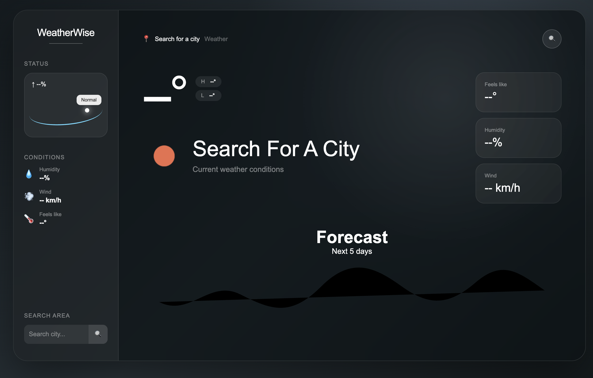

# 🌦️ WeatherWise

A modern and responsive Weather App built using **HTML, CSS, and JavaScript**. This project displays current weather conditions and a 5-day forecast for any searched city using the **OpenWeatherMap API**.

---

## 📸 Screenshot



---

## 🚀 Features

- 🌡️ Current temperature
- 🌤️ Current weather condition
- 🌡️ Feels-like temperature
- 💧 Humidity information
- 💨 Wind speed
- 📅 5-day weather forecast
- 🔍 Search weather by city
- 🌈 Weather-based background
- 🪟 Modern glassmorphism UI
- 📱 Responsive design
- ⚡ Fast and lightweight
- 🎨 Clean and modern interface

---

## 🛠️ Built With

- HTML5
- CSS3
- JavaScript (ES6)
- OpenWeatherMap API

---

## 📂 Project Structure

```text
WeatherWise/
│── index.html
│── style.css
│── script.js
│── WeatherWise.png
│── README.md
```

---

## ▶️ How to Run

1. Clone the repository:

```bash
git clone https://github.com/vishwakarmasneha846-max/WeatherWise
```

2. Open the project folder.

3. Double-click **index.html** or open it using **Live Server** in VS Code.

---

## 🌐 Live Demo

[View WeatherWise Live](https://vishwakarmasneha846-max.github.io/WeatherWise/)

---

## 🎯 Future Improvements

📍 Current location detection
🌅 Sunrise and sunset information
☔ Rain probability
📊 Temperature graph
🕐 Hourly weather forecast
🌙 Dark/Light mode
⭐ Favorite cities
🧭 Wind direction
🌡️ Celsius/Fahrenheit conversion
🔔 Weather alerts
🎨 Advanced weather animations
🌧️ Animated rain effects
❄️ Animated snowfall
📱 Improved mobile responsiveness
💾 Save favorite locations

---

## 🤝 Contributing

Contributions are welcome!

1. Fork this repository.
2. Create a new branch.
3. Make your changes.
4. Submit a Pull Request.

---

## 👩‍💻 Author

**Sneha **

- GitHub: https://github.com/vishwakarmasneha846-max
---

## 👩‍💻 Acknowledgement

OpenWeatherMap for providing weather data.
GitHub for project hosting.
Visual Studio Code for development tools.

⭐ If you like this project, don't forget to star the repository!